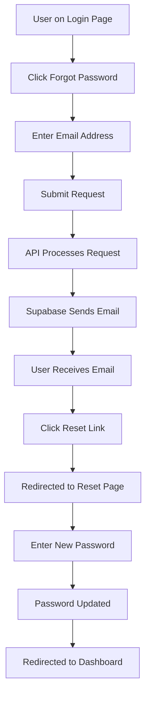

## Overview

The forgot password system allows users to reset their password when they can't remember it. The implementation follows a secure flow using Supabase's built-in authentication system combined with custom email templates.

## Architecture

### 1. **API Route** (`/api/auth/forgot-password`)
- **Location**: `app/api/auth/forgot-password/route.ts`
- **Purpose**: Handles password reset requests
- **Method**: POST
- **Input**: `{ email: string }`

**Key Features:**
- Validates email input
- Uses Supabase's `resetPasswordForEmail` method
- Redirects users to `/auth/reset-password` after email verification
- Sends custom email notification using our template system

**Flow:**
```typescript
// 1. Validate email input
if (!email) {
  return NextResponse.json({ error: 'Email is required' }, { status: 400 });
}

// 2. Request password reset from Supabase
const { error } = await supabase.auth.resetPasswordForEmail(email, {
  redirectTo: `${process.env.NEXT_PUBLIC_SITE_URL}/auth/reset-password`,
});

// 3. Return success/error response
```

### 2. **Login Page Integration**
- **Location**: `app/auth/login/page.tsx`
- **Implementation**: Inline forgot password form (no separate page)
- **State Management**: Uses React state to toggle between login and forgot password views

**User Experience:**
1. User sees login form
2. Clicks "Forgot Password?" link
3. Login form is replaced with forgot password form
4. User enters email and submits
5. Success/error message is displayed
6. User can return to login form

**Key States:**
```typescript
const [showForgotPassword, setShowForgotPassword] = useState(false);
const [forgotPasswordEmail, setForgotPasswordEmail] = useState('');
const [forgotPasswordLoading, setForgotPasswordLoading] = useState(false);
const [forgotPasswordError, setForgotPasswordError] = useState<string | null>(null);
const [forgotPasswordSuccess, setForgotPasswordSuccess] = useState(false);
```

### 3. **Reset Password Page**
- **Location**: `app/auth/reset-password/page.tsx`
- **Purpose**: Allows users to set a new password after email verification
- **Access**: Via email link or direct navigation with valid session

**Features:**
- Session validation
- Access token handling from URL parameters
- Password confirmation
- Success feedback and redirect

**Session Validation:**
```typescript
useEffect(() => {
  const checkSession = async () => {
    const { data: { session } } = await supabase.auth.getSession();
    if (session?.user) {
      setIsValidSession(true);
    } else {
      // Check for access_token in URL (from email link)
      const accessToken = searchParams.get('access_token');
      if (accessToken) {
        const { error } = await supabase.auth.setSession({
          access_token: accessToken,
          refresh_token: '',
        });
        if (!error) {
          setIsValidSession(true);
        }
      }
    }
  };
  checkSession();
}, [supabase.auth, searchParams]);
```

### 4. **Email Template**
- **Location**: `supabase/email-templates/forgot-password.html`
- **Purpose**: Custom HTML email for password reset
- **Integration**: Configured in Supabase dashboard

## User Flow



## Security Features

1. **Email Verification**: Password reset only possible via verified email
2. **Secure Tokens**: Uses Supabase's secure token system
3. **Session Validation**: Ensures valid session before password change
4. **Rate Limiting**: Supabase handles rate limiting for reset requests
5. **Secure Redirects**: Only allows redirects to trusted domains

## Environment Variables

```bash
NEXT_PUBLIC_SITE_URL=https://yourdomain.com
```

## Testing

The forgot password functionality is thoroughly tested:

- **Location**: `__tests__/api/auth/forgot-password.test.ts`
- **Coverage**: API endpoint validation, error handling, success scenarios
- **Mocking**: Supabase client and email service are properly mocked

**Test Scenarios:**
- Missing email validation
- Empty email validation
- Successful password reset
- Supabase error handling
- Email service error handling

## Customization Options

### Email Template
The email template can be customized by editing:
- `supabase/email-templates/forgot-password.html`
- Supabase dashboard email settings

### Redirect URL
Change the redirect URL in the API route:
```typescript
redirectTo: `${process.env.NEXT_PUBLIC_SITE_URL}/auth/reset-password`
```

### Success Message
Customize success messages in the login page component.

## Troubleshooting

### Common Issues

1. **Email Not Received**
   - Check spam folder
   - Verify email address is correct
   - Check Supabase email configuration

2. **Reset Link Expired**
   - Links typically expire after 24 hours
   - User must request new reset

3. **Session Validation Fails**
   - Check access token in URL
   - Verify Supabase configuration

### Debug Steps

1. Check browser console for errors
2. Verify API endpoint is accessible
3. Check Supabase logs for authentication errors
4. Verify environment variables are set correctly

## Future Enhancements

1. **Dedicated Forgot Password Page**: Create standalone page instead of inline form
2. **Password Strength Requirements**: Add password validation rules
3. **Account Lockout**: Implement temporary account lockout after failed attempts
4. **Audit Logging**: Track password reset attempts for security monitoring
5. **Multi-factor Authentication**: Require additional verification for password resets

## Related Files

- `app/api/auth/forgot-password/route.ts` - API endpoint
- `app/auth/login/page.tsx` - Login page with inline forgot password
- `app/auth/reset-password/page.tsx` - Password reset page
- `supabase/email-templates/forgot-password.html` - Email template
- `__tests__/api/auth/forgot-password.test.ts` - Tests
- `lib/email.ts` - Email service utilities

## Notes

- The current implementation integrates forgot password into the login page rather than having a separate route
- Users access forgot password functionality through the login page interface
- The system leverages Supabase's built-in security features while providing custom email templates
- All password reset operations are logged and can be monitored through Supabase dashboard